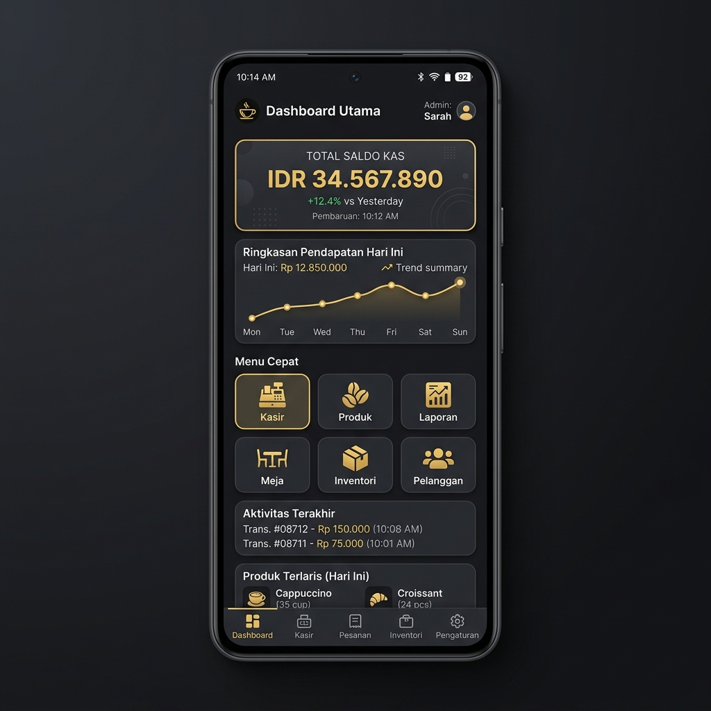

# ☕ KOPI JALANAN GANK — Aplikasi Kasir Digital Premium


> **Dikembangkan oleh [Neverland Studio](https://github.com/MuhammadIsakiPrananda1) · Lisensi MIT**

---

## 📖 Tentang Aplikasi

**KOPI JALANAN GANK POS** adalah aplikasi kasir digital (*Point of Sale*) yang dirancang khusus untuk kebutuhan operasional kedai kopi **KOPI JALANAN GANK**. Aplikasi ini dibangun dengan pendekatan **offline-first**, artinya seluruh proses transaksi, laporan, dan manajemen data berjalan sepenuhnya tanpa membutuhkan koneksi internet.

Dengan antarmuka modern bergaya **dark theme glassmorphic**, aplikasi ini menggabungkan kecepatan, keandalan, dan estetika premium dalam satu paket yang ringan dan efisien untuk perangkat Android.

---

## ✨ Fitur Utama

| Fitur | Deskripsi |
|---|---|
| 🚀 **Kasir Cepat** | Proses checkout efisien dengan manajemen keranjang belanja real-time |
| 📊 **Analisis Penjualan** | Laporan harian, mingguan, dan bulanan dengan grafik visual interaktif |
| 💰 **Manajemen Keuangan** | Pencatatan pemasukan & pengeluaran (manual + sinkronisasi otomatis dari penjualan) |
| 🖨️ **Cetak Struk Thermal** | Dukungan printer thermal Bluetooth untuk mencetak struk belanja |
| 📦 **Inventaris Produk** | Manajemen produk dan kategori yang mudah digunakan |
| 🎨 **UI/UX Premium** | Dark theme glassmorphic, animasi halus, dan tipografi profesional |
| 📴 **Offline-First** | Database SQLite lokal memastikan aplikasi berjalan tanpa internet |

---

## 🛠️ Bahasa Pemrograman & Teknologi

Aplikasi ini dibangun menggunakan teknologi berikut:

| Kategori | Teknologi |
|---|---|
| **Framework** | [Flutter](https://flutter.dev) |
| **Bahasa Pemrograman** | [Dart](https://dart.dev) |
| **Database** | [SQLite](https://sqlite.org) — penyimpanan data lokal pada perangkat |
| **State Management** | [Provider](https://pub.dev/packages/provider) |
| **Grafik & Chart** | [FL Chart](https://pub.dev/packages/fl_chart) |
| **Tipografi** | [Google Fonts](https://fonts.google.com) |
| **Printer** | [Print Bluetooth Thermal](https://pub.dev/packages/print_bluetooth_thermal) |

> **Dart** adalah bahasa pemrograman utama yang digunakan bersama **Flutter** (framework dari Google) untuk membangun aplikasi mobile Android yang cepat dan efisien dari satu basis kode.

---

## 📸 Cuplikan Layar

| Beranda (Dashboard) | Kasir (Cashier) | Laporan (Reports) |
|:---:|:---:|:---:|
|  |  |  |

---

## 🚀 Cara Menjalankan di Lokal

### ✅ Prasyarat

Pastikan komputer kamu sudah terinstal:

- [Flutter SDK](https://docs.flutter.dev/get-started/install) (versi stable terbaru)
- [Android Studio](https://developer.android.com/studio) atau [VS Code](https://code.visualstudio.com/) dengan ekstensi Flutter & Dart
- Perangkat Android fisik (API Level 21+) atau emulator Android

---

### 📦 Langkah Instalasi

**1. Clone repository**
```bash
git clone https://github.com/MuhammadIsakiPrananda1/pos-kopi-jalanan.git
```

**2. Masuk ke direktori project**
```bash
cd pos-kopi-jalanan
```

**3. Ambil semua dependencies**
```bash
flutter pub get
```

**4. Periksa konfigurasi Flutter (opsional tapi disarankan)**
```bash
flutter doctor
```

**5. Jalankan aplikasi ke perangkat / emulator**
```bash
flutter run
```

> 💡 **Tips:** Pastikan perangkat Android sudah terhubung lewat USB dan **USB Debugging** telah diaktifkan di menu *Developer Options*, atau gunakan emulator yang sudah berjalan di Android Studio.

---

## 📄 Lisensi

Proyek ini dilisensikan di bawah **Lisensi MIT** — lihat file [LICENSE](LICENSE) untuk detail selengkapnya.

---

## 👨‍💻 Pengembang

**Muhammad Isaki Prananda**
- GitHub: [@MuhammadIsakiPrananda1](https://github.com/MuhammadIsakiPrananda1)
- Studio: **NEVERLAND STUDIO**

---

<p align="center">Dikembangkan dengan ❤️ oleh <strong>Neverland Studio</strong></p>
